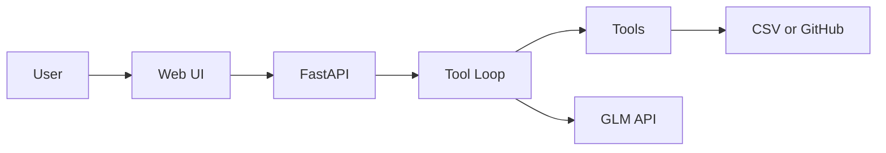

# Day 33 · 交付包 · 未学习

- **日期**：按实际学习日
- **时段**：2 小时
- **课程根**：`~/code/ai-learning/python`
- **阶段**：A 路线 · 第 5 个月 · 打磨上线
- **今日主题**：完整 README；架构图；2–5 分钟 Demo；可访问地址或本地一键
- **原则**：不再开新功能；文档让陌生人可运行
- **状态**：未学习
- **大纲**：`learning-outline.md` Day33

## 今日目标

1. 毕业项目（主）+ 知识库（辅）README 达到投递质量
2. `architecture.png` 或 mermaid 架构图
3. Demo：录屏 **或** 完整截图故事板 + 旁白稿（≤5 分钟）
4. `DELIVERY_CHECKLIST.md` 全绿

## 今日不学

新功能、换 UI 框架、大重构

---

## 时间表

| 时间 | 内容 | 产出 |
|------|------|------|
| 0:00–0:50 | README 终稿 | 两项目或一主一辅 |
| 0:50–0:55 | 休息 | — |
| 0:55–1:25 | 架构图 | 图文件 |
| 1:25–1:55 | Demo 录制/故事板 | 视频或 storyboard.md |
| 1:55–2:00 | 检查表 | 勾选 |

---

## README 必须章节

1. 一句话问题与用户  
2. 功能列表（MVP 范围）  
3. 架构图链接  
4. 技术选型与权衡（3 条够）  
5. 环境变量  
6. 本地 / Docker 运行  
7. 评测或 Demo 结果（链 EVAL / COST）  
8. 限制与路线图  
9. 踩坑  

知识库项目可把 Day25 README 升格为终版。

## 架构图（mermaid 可放 README）



## `DELIVERY_CHECKLIST.md`

```markdown
- [ ] 一键启动成功（冷启动按文档）
- [ ] Demo ≤5 分钟可讲完
- [ ] 无密钥进仓
- [ ] 有评测或成本数字至少一处
- [ ] ISSUES 诚实
- [ ] 架构图可读
```

---

## 验收清单

- [ ] 检查表全绿（或注明唯一环境限制）
- [ ] Demo 产物已落盘（`demo/` 目录）

## 明日预告

Day34：RAG 系统设计口述 + 项目深挖 10 题自问自答。
